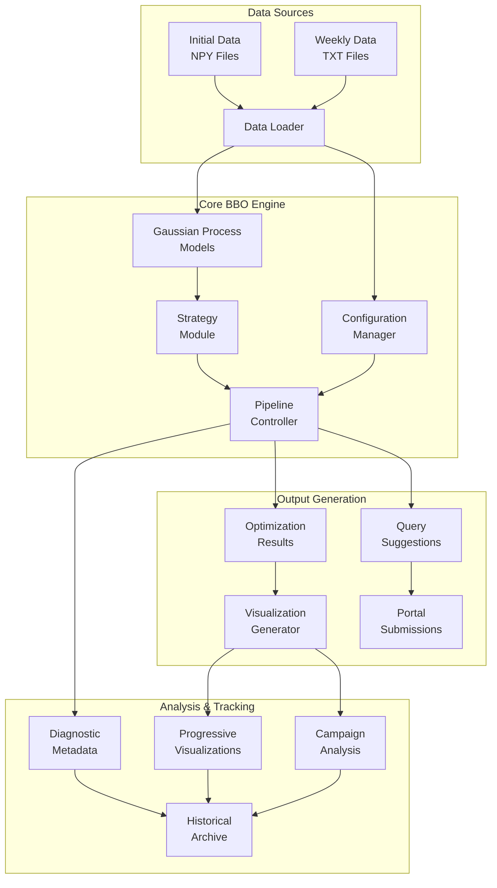
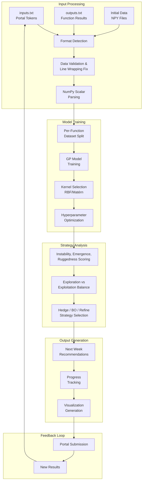
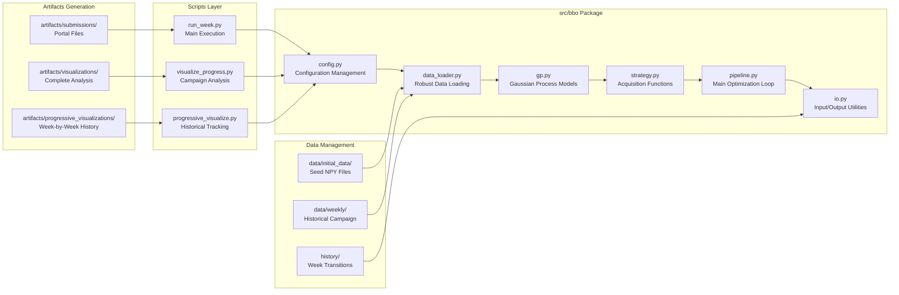
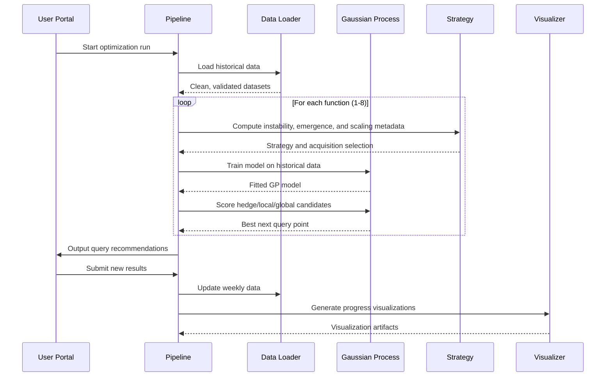
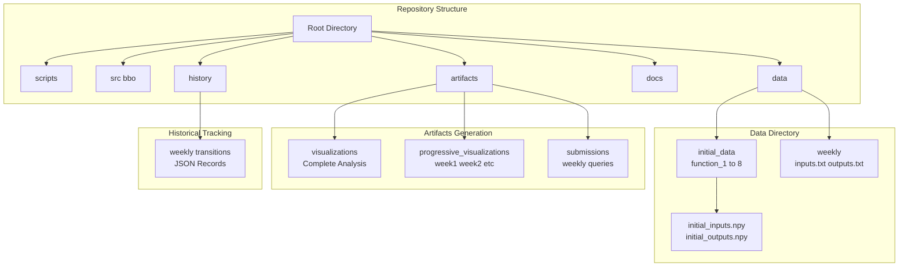

# Black-Box Optimization (BBO) System Architecture

## Overview

This document describes the architecture of the BBO capstone project, including system components, data flow, and module interactions.

## System Architecture



## Data Flow Architecture



## Module Organization



## Optimization Pipeline Flow



## File Structure and Data Flow



## Key Features

### Robust Data Management

- **Auto-format Detection**: Handles multiple input formats seamlessly
- **Line Wrapping Fix**: Automatically corrects wrapped data lines
- **NumPy Scalar Parsing**: Safely reads `np.float64(...)` rows from weekly outputs
- **Validation Pipeline**: Ensures data consistency across weeks

### Modular Gaussian Process System

- **Per-Function Models**: Independent GP models for each optimization target
- **Automatic Kernel Selection**: RBF and Matérn kernels with hyperparameter tuning
- **Fast GP Fallback**: Lightweight late-stage fitting path for high-dimensional cases
- **Scalable Architecture**: Easy addition of new acquisition functions

### Progressive Analysis Framework

- **Historical Preservation**: Week-by-week optimization state tracking
- **Cumulative Visualization**: Progressive view of campaign evolution
- **Performance Analytics**: Success rate and improvement tracking
- **Diagnostic Metadata**: Instability, emergence, ruggedness, and scaling summaries

## Technical Approach and Strategy Evolution

### Strategy Development Across Weeks

**Week 1 – Structured Exploration:**  
Initial queries prioritised coverage and diversity. With no feedback available, points were chosen away from boundaries to reduce uncertainty, especially in higher‑dimensional functions.

**Week 2 – Adaptive Exploration vs Exploitation:**  
Week‑1 outputs allowed relative performance comparison. Most functions remained exploratory due to high uncertainty, while promising regions began targeted refinement.

**Week 3 – Model‑Driven Bayesian Optimisation:**  
Gaussian Process models fitted per function with automatic kernel selection. Expected Improvement acquisition function balances posterior mean μ(x) and uncertainty σ(x) for optimal query placement.

**Week 4 – Fully Automated Pipeline:**  
Complete Bayesian optimisation system with automatic kernel switching, per‑function exploration/exploitation tuning, diagnostic tracking, and automated history preservation.

**Week 5 – Progressive Analysis Integration:**  
Enhanced with comprehensive visualization system tracking week-by-week optimization progress, enabling detailed campaign analysis and strategy validation.

**Week 6 – Advanced Optimization and Refinement:**  
Implemented sophisticated parameter tuning and convergence analysis. Advanced acquisition function strategies with adaptive exploration parameters, multi-objective balancing across function portfolios, and enhanced uncertainty quantification for robust decision-making in final optimization phases.

**Week 7 – Hybrid Switching Optimization:**  
Introduced dynamic switching between exploration, Bayesian optimisation, and local refinement.

**Week 8 – LLM-Aware Optimisation:**  
Added instability-sensitive scoring, boundary penalties, similarity control, and selective late-stage exploration.

**Week 9 – Scaling and Emergence-Aware Optimisation:**  
Added emergence scoring, ruggedness estimation, dimension-aware scaling pressure, hedge-based candidate generation, and high-dimensional fast GP fallback.

### Methods and Architecture Integration

- **Gaussian Process Regression**: RBF and Matérn kernels with automatic selection
- **Expected Improvement Acquisition**: Balances exploration and exploitation
- **Per-Function Tuning**: ξ (explore/exploit balance) and β (UCB weighting)
- **Progressive Visualization**: Week-by-week historical analysis system
- **Automated Data Management**: Robust loading with format auto-detection
- **Emergence Diagnostics**: Regime-shift and surface-ruggedness detection

## Configuration and Extensibility

The system supports configuration through:

- **Function-specific parameters**: Exploration/exploitation balance (ξ, β)
- **Model selection**: Kernel types and hyperparameter bounds
- **Visualization options**: Chart types and analysis depth
- **Strategy controls**: Instability thresholds, emergence weights, and scaling-pressure settings
- **Data format handling**: Input/output format specifications

This architecture enables efficient black-box optimization with comprehensive tracking and analysis capabilities.

## Detailed Repository Structure

```
bbo_capstone_matrix_weekly_project/
│
├── scripts/
│   ├── run_week.py                    # Main BBO execution pipeline
│   ├── visualize_progress.py          # Complete campaign visualization
│   └── progressive_visualize.py       # Week-by-week historical graphs
│
├── src/
│   └── bbo/                           # Core optimization modules
│       ├── __init__.py
│       ├── config.py                  # Configuration management
│       ├── data_loader.py             # Robust data loading with auto-format
│       ├── gp.py                      # Gaussian Process implementation
│       ├── io.py                      # Input/output utilities
│       ├── pipeline.py                # Main optimization pipeline
│       ├── pipeline.py                # Main optimization pipeline
|       └── strategy.py                # Acquisition strategies
|
│
├── data/
│   ├── initial_data/                  # Seed data (NPY format)
│   │   └── function_1..8/
│   └── weekly/                        # Historical campaign data
│       ├── inputs.txt                 # Query history (portal format)
│       └── outputs.txt                # Evaluation results
│
├── artifacts/
│   ├── visualizations/                # Complete campaign analysis
│   ├── progressive_visualizations/    # Week-by-week historical graphs
│   │   ├── week1/                     # Week 1 cumulative view
│   │   ├── week2/                     # Week 2 cumulative view
│   │   ├── ...                        # Progressive weekly analysis
│   │   └── README.md                  # Visualization guide
│   └── submissions/                   # Portal-ready queries
│
├── docs/                             # Project documentation
│   ├── architecture.md               # System architecture (this file)
│   ├── datasheet.md                  # Dataset documentation (query history + evaluations)
│   ├── model_card.md                 # Optimisation strategy documentation
│   └── cnn_integration_guide.md      # Optional extension guide
│
├── requirements.txt
└── README.md
```

## Component Details

### Core BBO Modules (`src/bbo/`)

**config.py** - Configuration Management

- Function-specific parameters (ξ, β tuning)
- Model selection settings (kernel types, hyperparameter bounds)
- Week 8 and Week 9 strategy thresholds and penalties
- Visualization and analysis options
- Data format specifications

**data_loader.py** - Robust Data Loading

- Auto-format detection for multiple input formats
- Line wrapping detection and correction
- Safe parsing for array-style and `np.float64(...)` rows
- Week numbering validation and consistency checks
- Historical data validation pipeline

**gp.py** - Gaussian Process Implementation

- Per-function GP models with independent training
- Automatic kernel selection (RBF and Matérn)
- Hyperparameter optimization with bounds
- Predictive uncertainty quantification
- Hedge candidate generation and ruggedness penalties
- Fast GP fitting path for high-dimensional late-stage cases

**strategy.py** - Acquisition Strategies

- Expected Improvement acquisition function
- Exploration vs exploitation balance (ξ parameter)
- Upper Confidence Bound weighting (β parameter)
- Instability, emergence, and ruggedness diagnostics
- Per-function strategy tuning and hedge switching

**pipeline.py** - Main Optimization Pipeline

- Orchestrates data loading, model training, and query generation
- Handles per-function optimization loops
- Computes emergence and scaling metadata before model scoring
- Manages historical data updates and preservation
- Integrates visualization and progress tracking

**io.py** - Input/Output Utilities

- Portal token format handling
- Query result processing and validation
- Historical transition recording
- Artifact generation and organization

### Execution Scripts (`scripts/`)

**run_week.py** - Main BBO Execution

- Primary entry point for optimization runs
- Command-line interface with configurable data directories
- Automated pipeline execution with error handling
- Progress tracking and result output

**visualize_progress.py** - Complete Campaign Analysis

- Generates comprehensive optimization visualizations
- Performance analytics and success rate tracking
- Function-specific progress trajectories
- Campaign-wide summary statistics

**progressive_visualize.py** - Historical Analysis

- Week-by-week historical visualization preservation
- Cumulative view generation for each optimization week
- Progressive analysis with consistent scaling
- Historical archive management

### Data Management Structure

**Initial Data (`data/initial_data/`)**

- Function-specific seed data in NPY format
- `initial_inputs.npy` and `initial_outputs.npy` per function
- Serves as baseline for model initialization
- Supports functions 1-8 with varying dimensionality

**Weekly Data (`data/weekly/`)**

- Historical campaign data in text format
- `inputs.txt` - Portal token submissions (matrix format)
- `outputs.txt` - Function evaluation results (matrix format)
- Supports plain float rows, arrays, and NumPy scalar encodings
- Each row represents a week's queries across all 8 functions

**Historical Tracking (`history/`)**

- Week-to-week transition records in JSON format
- Optimization state preservation between runs
- Campaign progression tracking and analysis
- Enables historical replay and analysis

### Artifact Generation

**Complete Analysis (`artifacts/visualizations/`)**

- Campaign-wide optimization analysis
- Function performance comparisons
- Success rate and improvement analytics
- Comprehensive progress summaries

**Progressive History (`artifacts/progressive_visualizations/`)**

- Week-by-week cumulative views
- Historical optimization state preservation
- Progressive analysis with consistent formatting
- Enables detailed campaign evolution tracking

**Submissions (`artifacts/submissions/`)**

- Portal-ready weekly query files
- Six-decimal token formatting for all functions
- Supports reproducible handoff to the capstone portal

## Technical Implementation Details

### Gaussian Process Architecture

- **Independent Models**: Each function (1-8) has dedicated GP model
- **Kernel Selection**: Automatic RBF/Matérn kernel comparison
- **Hyperparameter Tuning**: Bounded optimization with validation
- **Scalability**: Efficient handling of increasing dimensionality
- **Fast Mode Support**: Reduced restart path for high-dimensional late-stage optimisation

### Acquisition Function Framework

- **Expected Improvement**: Primary acquisition strategy
- **Exploration Control**: ξ parameter for exploration/exploitation balance
- **Uncertainty Weighting**: β parameter for confidence-based decisions
- **Per-Function Tuning**: Independent parameter optimization
- **Hedge Switching**: Blends local and global candidate generation when risk increases

### Data Processing Pipeline

- **Format Auto-Detection**: Handles multiple input format variations
- **Line Wrapping Recovery**: Automatically fixes data formatting issues
- **Scalar Payload Parsing**: Correctly extracts values from `np.float64(...)` wrappers
- **Validation Framework**: Ensures data consistency and completeness
- **Historical Integrity**: Maintains campaign data across weekly updates

### Visualization System

- **Progressive Preservation**: Historical state tracking across weeks
- **Consistent Scaling**: Unified visualization standards
- **Multi-Level Analysis**: Campaign, weekly, and function-specific views
- **Automated Generation**: Integrated visualization pipeline

This comprehensive architecture supports efficient black-box optimization with robust data management, sophisticated modeling capabilities, and extensive analysis frameworks for optimization campaign tracking and validation.
